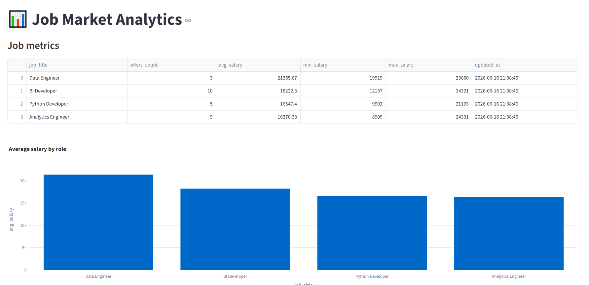
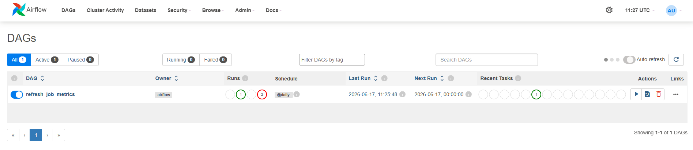
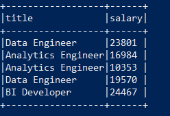

# Job Market Streaming Data Platform

End-to-end Data Engineering project that simulates real-time job market analytics using modern streaming architecture.

The system generates job events, streams them through Apache Kafka, processes data with Apache Spark Structured Streaming and stores analytics results in PostgreSQL.

---

## Architecture

```
                 Job Producer
                      |
                      v
                Apache Kafka
                      |
                      v
        Spark Structured Streaming
                      |
                      v
              PostgreSQL RAW Layer
                      |
                      v
               Apache Airflow
                      |
                      v
            Analytics Data Layer
                      |
                      v
              Streamlit Dashboard
```

📌 Detailed architecture:

[View architecture documentation](docs/architecture.md)

---

## Tech Stack

### Data Engineering

- Apache Kafka
- Apache Spark Structured Streaming
- Apache Airflow
- PostgreSQL
- Python

### Processing

- PySpark
- Pandas
- SQL

### Visualization

- Streamlit
- Plotly

### Infrastructure

- Docker
- Docker Compose


---

# Data Pipeline

## 1. Data Producer

Python producer generates fake job market events.

Example event:

```json
{
    "job_id": "uuid",
    "title": "Data Engineer",
    "company": "Example Ltd",
    "location": "Warsaw",
    "salary": 18000,
    "skills": [
        "Python",
        "Spark",
        "Kafka"
    ]
}
```

---

## 2. Kafka Streaming

Kafka stores events in:

```
topic: job_events
```

Spark consumes events continuously using Structured Streaming.

---

## 3. Spark Processing

Spark performs:

- JSON parsing
- schema validation
- transformations
- streaming processing


Output:

```
job_events_raw
```

---

## 4. Analytics Layer

Airflow refreshes aggregated metrics:

Example:

```
job_metrics
```

Metrics:

- number of offers
- average salary
- min salary
- max salary


---

# Dashboard

Streamlit dashboard presents:

- salary analytics
- job popularity
- market trends


URL:

```
localhost:8501
```
---
## Screenshots


### Streaming Dashboard




### Airflow DAG




### Spark Streaming




---

# Airflow

Airflow DAG:

```
refresh_job_metrics
```

Responsibilities:

- schedule analytics refresh
- execute SQL transformations


UI:

```
localhost:8080
```

---

# Docker Services


```
docker compose up -d
```


Services:

| Service | Description |
|-|-|
| Kafka | Event streaming |
| Spark | Stream processing |
| PostgreSQL | Storage |
| Airflow | Orchestration |
| Streamlit | Dashboard |

---

# Project Structure


```
├── producer/
│   ├── job_producer.py
│   └── data_generator.py

├── spark/
│   └── streaming_job.py

├── airflow/
│   └── dags/

├── dashboard/
│   └── app.py

├── sql/

└── docker-compose.yml

```

---

# Features

Implemented:

✔ Real-time event streaming  
✔ Kafka producer  
✔ Spark Structured Streaming  
✔ PostgreSQL persistence  
✔ Analytics tables  
✔ Airflow orchestration  
✔ Interactive dashboard  
✔ Docker environment  


---

# Future Improvements

- AWS S3 Data Lake
- dbt transformations
- Snowflake warehouse
- Kubernetes deployment
- CI/CD pipeline


---

# Author

Natalia Kurek
Created as a Data Engineering portfolio project.